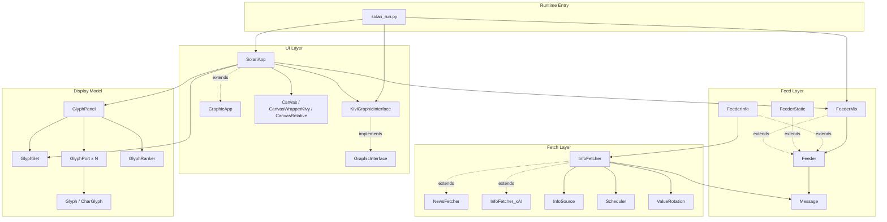
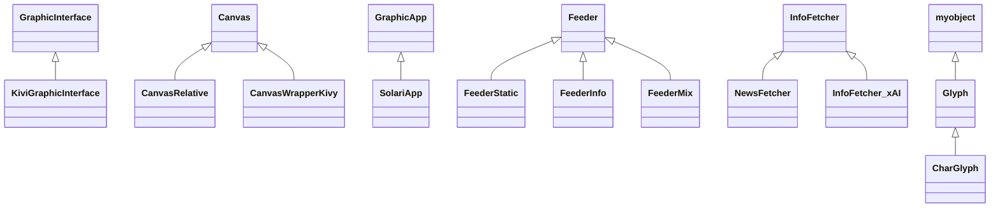
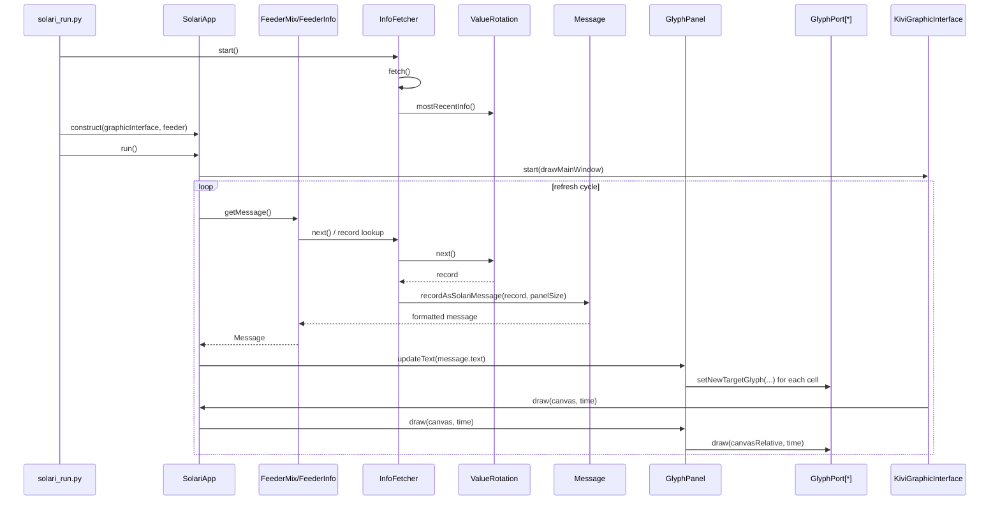

# solari

## A simple Python program that emulates the old Solari panels which were place in airports and other public places to provide information such as flight departures and arrivals

	
	&nbsp;&nbsp;&nbsp;&nbsp;
	

A demo youtube video is available below.

## Features

## Quick start

### prepare environment

[create environment - install dependendcies]
[rename and configure .env.example with user's API keys]

### run solari

## Program structure

### Layered architecture

### Inheritance tree

## How it works 

### the vizualation logic

### the news gathering logic

### News item to animated panel sequence

## Demo

  <a href="https://youtu.be/Kv-tkJvaFZI">
    

    
    

  </a>

## License
This project is licensed under the GNU Affero General Public License v3.0 (AGPLv3) for open-source and non-commercial use.
For commercial use, closed-source integration, SaaS deployment, or enterprise licensing, please contact me.

## Editing credits
Grok and Microsoft Copilote assisted Alex Scherer in editing this readme file, most significantly by proposing verbiage for the sections analyzing how the code works and proposing grammar and stylistic corrections. 

## Disclaimer
This tool is presented "as is", for educational and informational purposes only. It is not financial advice. Always consult a qualified financial advisor for actual investment decisions.
