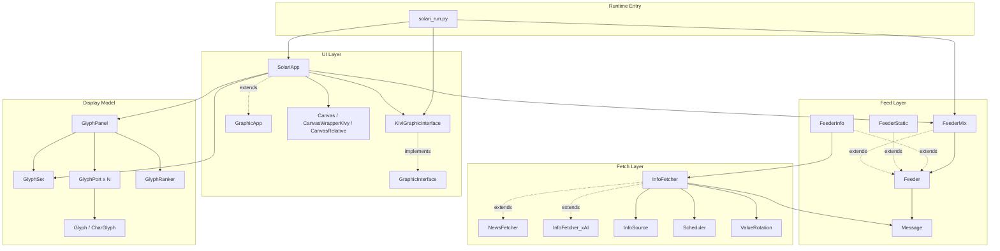

# solari

**A Python-powered split-flap display that brings back the nostalgic clack-clack-clack of airport and train station boards — now with live news, an xAI-powered agent, and smooth animations.**

<p align="center">
	
	&nbsp;&nbsp;&nbsp;&nbsp;
	
</p>

## Demo

A short demo video is available here. Just click on the picture to start the YouTube video.

<p align="center">
  <a href="https://youtu.be/iOUrp0WD6OI">
    
  </a>
</p>

If you want the quick version: Solari launches a split-flap style board, gathers messages from selected information sources, and animates them as if they were being physically flipped into place.

## Features

- Split-flap inspired display animation with a strong retro information-board feel
- Live message rotation built from multiple news and information sources
- News sourced from RSS feeds and an AI-backed news agent
- A modular structure separating rendering, message feeding, and data fetching
- Configurable panel dimensions and display behavior
- Interact with the panel at runtime using the keyboard
- Background fetching with local cache files to avoid re-fetching everything every time
- A codebase designed for learning and experimenting: threads, object structure, AI API calls, etc.
- Flexible and ready for further developments

## Quick Start

### Prepare a virtual environment

Create a Python virtual environment in the project root.

```bash
python3 -m venv .venv
```

Select the newly created environment
```bash
source .venv/bin/activate
```

Install the Python packages required by the project in that environment.

The repository now includes a `requirements.txt` for the main application (`solari_run.py`). Install everything with:

```bash
python -m pip install -r requirements.txt
```


### Configure environment variables (can be skipped if AI content not needed)

Copy the example environment file and add any API keys you want to use.

```bash
cp .env.example .env
```

The committed example file currently includes a placeholder for:

- `XAI_API_KEY`

That key is used by the main information-fetching flow. If you leave it unset, the xAI-backed fetcher will not be able to authenticate. 
If you need a key, go to https://console.x.ai/ to setup a xAI account. Then obtain a key and copy it in your .env file. Note that, if not xAI key is provided, the Solari panel will work but will not generate xAI news content.

### Run Solari

Start the main application from the project root.

```bash
python code/solari_run.py
```

On startup, Solari builds the display, initializes the selected information sources, starts background fetching, and begins animating messages onto the board.

At runtime, you can press `f` to toggle fullscreen mode. You can also press `l` to open the link associated with the currently displayed message when that message includes one.


### Configuration of the news gathering process

News can come from two kinds of sources: traditional RSS feeds and an AI-backed news agent. Both are handled through the same fetcher pipeline, cached locally, and then converted into fixed-width messages that can be displayed on the Solari board.

#### <U>RSS Feeds</U>

RSS feeds provide the project's most direct news sources. Each feed is fetched from its published RSS endpoint, parsed into individual records, timestamped, and stored in the local cache. Solari can then rotate through those items and display them as board messages while preserving the original source identity.

This approach keeps the content path simple and inspectable: the application reads what the publisher exposes, normalizes the result, and turns the item title into a message suitable for the panel. It is a straightforward way to connect the display to real-world news outlets without introducing additional editorial logic.

If you want to add, remove, or change RSS sources, edit the `InfoSource` entries in `infofetch.py`, where each source is mapped to its RSS URL and timezone. To choose which of those feeds are actually shown when the app runs, update the `sources` list in `solari_run.py`.


#### <U>AI backed content</U>

The AI-backed source uses a prompt-driven fetcher rather than a fixed RSS endpoint. In the current code, that means sending a news-gathering prompt to xAI, receiving a structured response, and converting the returned items into the same internal record format used by RSS sources.

The prompt text itself is stored in `resources/prompts/news_gathering.txt`. If you want to change the AI source's instructions or editorial style, that is the file to edit.

This makes the AI path useful when you want curated or synthesized news selection rather than raw feed output. Because it flows through the same caching, rotation, and display pipeline as the RSS sources, it can coexist with them naturally while still being configured separately through the API key and prompt file.


## What Solari Does

At runtime, Solari combines three kinds of work.

First, it maintains a graphical split-flap display and redraws it continuously so each character transition feels animated rather than instantaneous.

Second, it gathers records from selected information sources in the background and keeps recent results available for display.

Third, it turns those records into fixed-width messages that fit the board and rotates through them over time.

That split between display logic, feeder logic, and fetch logic is what makes the project fun to explore: it is not just a visual effect, and it is not just a feed reader. It is a small system built around the idea of giving live information a physical-looking presentation.

This project can be adapted to other information sources:
- weather
- live flight information
- famous quotes
- calendar reminders
- stock prices
- etc.

## Project Structure

All files are located in the `code` directory. A few files are especially important if you want to understand the project quickly.

- `solari_run.py` is the main entry point. It assembles the graphic interface, chooses the active sources, builds the feeders, and starts the app.
- `solari.py` contains the core display model: glyphs, ports, panels, timing, and the main application behavior.
- `grkivy.py` provides the Kivy-based rendering backend and connects the app logic to the UI event loop.
- `grabst.py` defines the graphics abstractions that sit between the display model and the concrete UI implementation.
- `feeder.py` builds and combines message feeders.
- `infofetch.py` handles source fetching, scheduling, cache management, and record rotation.
- `common.py` contains shared helpers, scheduling utilities, paths, logging, and common data structures.

## How It Works

### Display logic

The display is built from glyphs and panels rather than from plain text widgets.

Each visible character position behaves like a small flip unit. When a message changes, Solari does not simply replace one string with another. Instead, each position moves through glyph transitions so the board feels closer to a physical split-flap mechanism. That is where much of the personality of the project comes from.

### News gathering logic

The live-content side is handled separately from the drawing side.

Information fetchers pull records from selected sources, keep the most relevant items, and store cached results locally. A feeder layer then turns those records into displayable messages. This lets the display remain focused on timing and animation while the fetchers deal with network access, freshness, and source-specific formatting.

### Message flow

The overall path from source data to animated board text looks like this:

1. Solari starts the selected information sources.
2. Fetchers gather records and keep recent results available.
3. Feeders select or rotate a message from the available content.
4. The message is adapted to the board dimensions.
5. The panel updates each display position toward its target glyph.
6. The Kivy frontend redraws the result frame by frame.


## Architecture

The architecture is intentionally layered. The point is not only to get pixels on the screen, but to keep the project easy to evolve.

The runtime entry point wires together the display, the feeder layer, and the fetch layer. The UI layer is responsible for drawing and event-loop integration. The feed layer decides what message should come next. The fetch layer retrieves and refreshes records. The display model handles how those messages become animated glyph transitions.

### Layered architecture



### Inheritance tree

This inheritance view is mostly useful if you want to extend the system, for example by swapping a feed strategy, adding a new fetcher, or experimenting with another rendering backend.


## License

This project is licensed under the GNU Affero General Public License v3.0.

If you are interested in commercial use, closed-source integration, SaaS deployment, or enterprise licensing, please contact the author.

## Credits

Solari is a personal project by Alex Scherer.

It was developed as both a software exercise and a visual homage to the split-flap information boards that once gave public spaces a distinctive mechanical rhythm. AI tools assisted with some editing and wording during development, but the project's structure, implementation, and direction remain author-driven.

## Disclaimer

This project is provided as-is for educational, experimental, and informational purposes.
