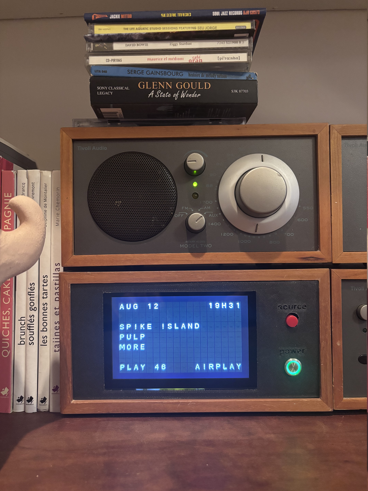
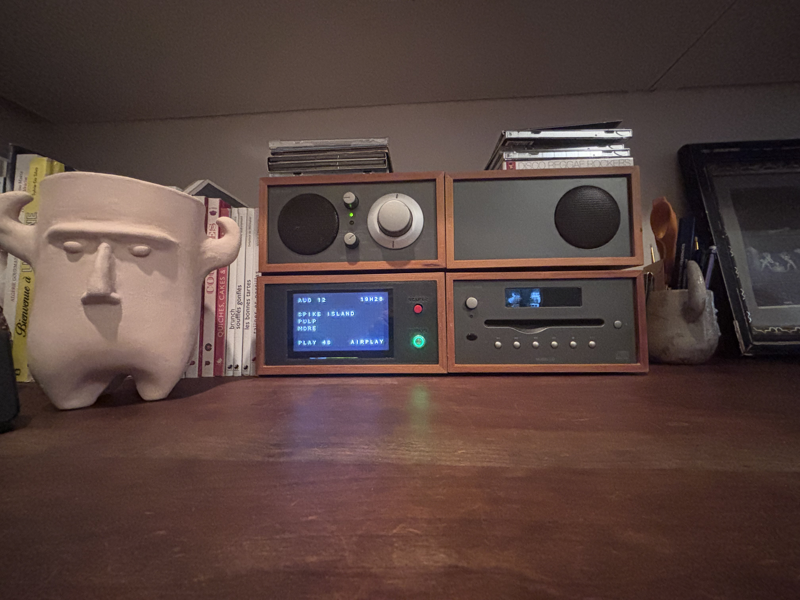
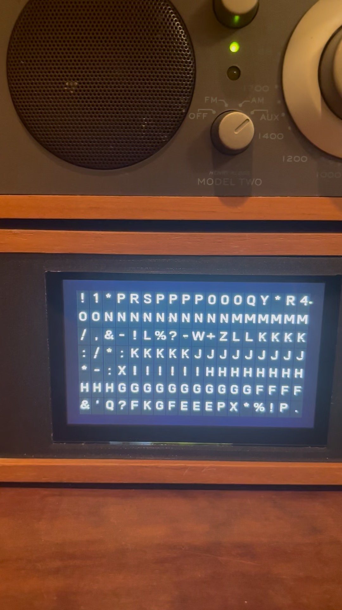
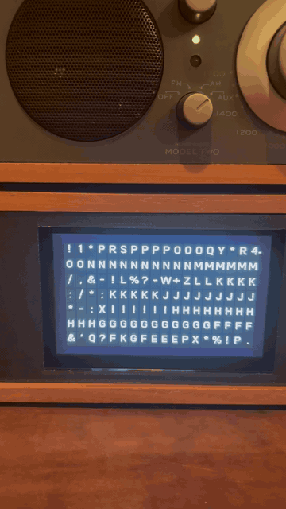

# Tivoli — Solari on the Volumio Raspberry Pi

This note is the install/update record for running Solari as the now-playing
display on the Tivoli player. **Update this file in git whenever the Pi setup
changes**, then copy it to the Pi (or just launch Solari — `run-tivoli.sh`
refreshes `/home/volumio/TIVOLI.md`).

| Copy | Path |
|---|---|
| Source of truth | this file, on branch `tivoli` |
| On the Pi (tree) | `/home/volumio/solari/TIVOLI.md` |
| On the Pi (home) | `/home/volumio/TIVOLI.md` |

Repo: https://github.com/ajmscherer/solari  
Branch: `tivoli`  
Mac checkout: `/Users/alex/Documents/CODE/PUBLISHED/solari`

Default `main` is the news board. Tivoli is **only** on when launched with the
`tivoli` argument.

```bash
python code/solari_run.py              # same as main
python code/solari_run.py tivoli       # Volumio now-playing
python code/solari_run.py tivoli -fs
```

<p align="center">
  
</p>

---

## What Tivoli is

- Hardware: Raspberry Pi 3 Model B Plus, Allo Boss / Innomaker I2S DAC, 640×480
  touchscreen (`wch.cn USB2IIC_CTP_CONTROL`)
- OS: Volumio 3.912 (Raspbian Buster, **Python 3.7.3**, armv7l)
- Player: hostname `tivoli`, typically `<tivoli-ip>`, user `volumio`
- Solari talks to Volumio at `http://127.0.0.1:3000/api/v1/getState`

Do **not** replace Volumio’s system Python. Do **not** run the Chromium kiosk
and Solari at the same time (869 MB RAM).

<p align="center">
  
</p>

---

## Layout on disk (Pi)

```
/home/volumio/solari/           # application tree
  TIVOLI.md
  run-tivoli.sh                 # Pi launch (forces SDL2/X11)
  code/                         # Python sources
/home/volumio/.local/           # pip --user: Kivy 2.3.0, Pillow 9.x, schedule
/home/volumio/TIVOLI.md         # extra copy of this note
/opt/volumiokiosk.sh            # stock Volumio Now Playing kiosk (fallback)
```

There is no git checkout on the Pi unless you create one (see below). Historically
the tree was copied with `rsync`/`scp` from the Mac.

---

## Reinstall after a fresh Volumio image

### 1. Packages

```bash
sudo apt-get update
sudo apt-get install -y python3-pip \
  libsdl2-image-2.0-0 libsdl2-ttf-2.0-0 libsdl2-mixer-2.0-0
```

`libsdl2-2.0-0` is already on Volumio. pip may pull `build-essential`; that is OK.

### 2. Python deps (PiWheels, user install)

```bash
pip3 install --user --extra-index-url https://www.piwheels.org/simple \
  'Kivy==2.3.0' 'Pillow<10' 'requests<2.32' schedule
```

Kivy **2.3.1** has no cp37 armv7l wheel. Stay on **2.3.0**.  
Do not install `xai-sdk` or `simpleaudio` for Tivoli mode (lazy-imported).

### 3. Application code

From this Mac (after `git checkout tivoli`):

```bash
rsync -az --exclude '.venv' --exclude '.git' --exclude 'cache' --exclude 'logs' \
  --exclude '.zed' --exclude '__pycache__' \
  /Users/alex/Documents/CODE/PUBLISHED/solari/ \
  volumio@<tivoli-ip>:/home/volumio/solari/
```

Or on the Pi, clone the branch:

```bash
git clone -b tivoli https://github.com/ajmscherer/solari.git /home/volumio/solari
```

```bash
chmod +x /home/volumio/solari/run-tivoli.sh
cp /home/volumio/solari/TIVOLI.md /home/volumio/TIVOLI.md
```

### 4. Take the screen (stop the kiosk)

The Touch Display plugin starts Chromium via `/opt/volumiokiosk.sh`. Solari needs
that X session **or** its own `startx`.

```bash
# stop Chromium kiosk (comes back on a Volumio reboot unless you change boot)
pkill -f /opt/volumiokiosk.sh || true
killall chromium-browser 2>/dev/null || true
killall Xorg 2>/dev/null || true
sleep 2

setsid startx /home/volumio/solari/run-tivoli.sh -fs -- :0 -nocursor \
  </dev/null >/tmp/solari-x.log 2>&1 &
```

`run-tivoli.sh` sets `KIVY_WINDOW=sdl2`, `KIVY_GL_BACKEND=sdl2`,
`KIVY_BCM_DISPMANX=0`. Without those, Kivy uses `egl_rpi` and dies on `/dev/vchiq`.

### 5. Restore stock Now Playing

```bash
killall python3 2>/dev/null || true
killall Xorg 2>/dev/null || true
sleep 2
setsid startx /opt/volumiokiosk.sh -- :0 -nocursor </dev/null &
```

A reboot also returns the Volumio kiosk unless you add a boot service.

---

## How the Pi tree gets updated

1. Change code on the Mac, on branch `tivoli`.
2. Commit / push to GitHub.
3. Copy to the Pi (`rsync` as above, or `git pull` if you cloned).
4. Restart Solari (`/tmp/restart-tivoli-display.sh` if present, or the
   `startx … run-tivoli.sh` block).
5. If this note changed, edit **this file in git** first. The next Solari start
   copies it to `/home/volumio/TIVOLI.md`.

The Pi does **not** pull GitHub by itself.

---

## Switching displays

| From | To | Action |
|---|---|---|
| Solari | Volumio | Tap the screen (or press `v` on a keyboard) |
| Volumio | Solari | Browse → **Solari** tile (Now Playing browse, or the Sources list) |
| Boot / reboot | Solari | Default. `volumio-kiosk.service` starts `tivoli/tivoli-session.sh` |

Mode is stored in `/home/volumio/.tivoli-display-mode` (`solari` or `volumio`).
Scripts: `tivoli/switch-to-solari.sh`, `tivoli/switch-to-volumio.sh`.

One-time install (after the files are on the Pi):

```bash
bash /home/volumio/solari/tivoli/install-display.sh
echo volumio | sudo -S systemctl restart volumio-kiosk.service
volumio vrestart
```

That writes a systemd drop-in so a reboot comes up on Solari, and registers the
Browse tile. Leave the Touch Display plugin enabled (it owns the kiosk unit).

---

## Display calibration (current)

<p align="center">
  
  &nbsp;&nbsp;
  
</p>

Framebuffer is **640×480** (confirmed via `fb0` and `xrandr`).  
Tivoli mode forces that size in Kivy **before** the window is created.

| Setting | Value |
|---|---|
| Panel | 18 columns × 7 rows |
| Overscan (L,B,R,T) | 28, 28, 28, 28 (equal; board is then centered) |
| Frame rate | 6 |
| Glyph size | computed from the usable 584×424 rectangle |

Constants live in `code/volumio.py` (`TIVOLI_*`). Layout is a compact now-playing
card (date/time, title/artist/album, `PLAY 46` / source).

Graphics are Mesa **llvmpipe** (CPU). Fine for 18×7 at 6 fps with cached
textures. Do not let `simpleaudio` open the Boss DAC.

---

## Mac-side check (no Pi display)

```bash
cd /Users/alex/Documents/CODE/PUBLISHED/solari
source .venv/bin/activate
python code/solari_run.py tivoli --host <tivoli-ip>
```

If that fails with `NO ROUTE` from the IDE, allow **Local Network** for Python
in macOS Privacy settings. Terminal usually already has permission.

VS Code launch item (local `.vscode/launch.json`, gitignored):
**Tivoli (Volumio now-playing)** → `tivoli --host <tivoli-ip>`.

---

## When you change Solari-for-Pi

Update **this file in the same PR/commit** (packages, paths, overscan, launch).
Then deploy so both Pi copies stay current.
